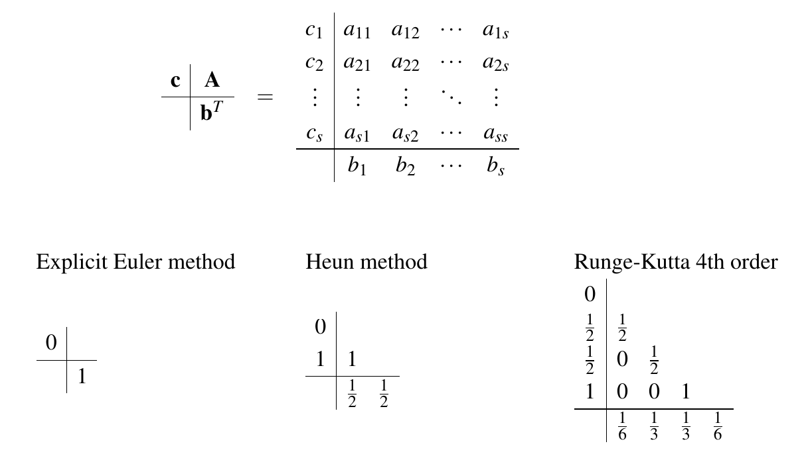
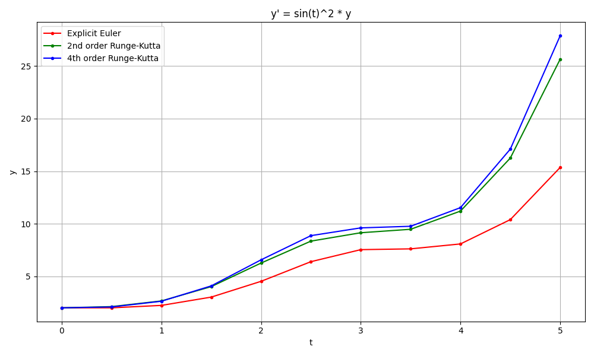

# Runge-Kutta-Solver

This repository contains the implementation of a general Runge-Kutta solver for differential equations for initial value problems (IVPs). This solver offers the option of transferring a control variable to the system, which is why it is suitable for control engineering applications. A specific butcher table is passed when the solver is instantiated, which is why different explicit solution variants can be implemented quickly.

---
## System Definition  
The differential equation must be in the following form in order to be solved with this solver. In c++ code, for example, this can be formulated as a lambda expression.

```math
\dot{x}(t) = f(t, x(t), u(t))
```
```math
x(t_0) = x_0, \quad u(\cdot)
```

With:

$$
\begin{aligned}
t &:~~ \text{Time, } t \in [t_0, b] \\
x &:~~ \text{System state, consisting of } n \text{ state variables } x \in \textit{Y} \subseteq \mathbb{R}^n \\
u &:~~ \text{Control input, consisting of } m \text{ control variables }u \in \textit{U} \subseteq \mathbb{R}^m
\end{aligned}
$$


## Generalized Runge-Kutta Methods  

Generalized Runge-Kutta methods are represented using the following formulas:  
```math
x_{k+1} = x_k + h \cdot \sum_{j=1}^{s} b_j \cdot k_j
```
```math
k_j = f\left(t_k + h \cdot c_j, x_k + h \cdot \sum_{l=1}^{j-1} a_{jl} \cdot k_l, u_k\right)
```

### Butcher Tableau  
These methods are defined using a Butcher Tableau:  


The attached test code generates a similar image to the one on the Wikipedia page.
https://en.wikipedia.org/wiki/Runge%E2%80%93Kutta_methods


